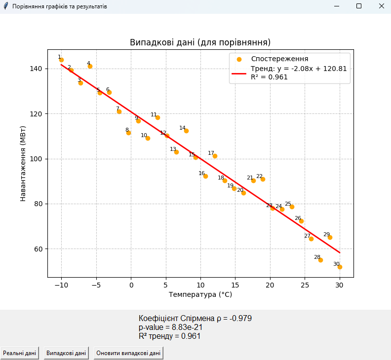

# EnergyCorrelator

Інтерактивний інструмент для аналізу та візуалізації залежності навантаження енергосистеми від температури повітря з використанням коефіцієнта кореляції Спірмена.

## 📌 Можливості
- Завантаження реальних даних з CSV-файлу.
- Генерація “реалістичних випадкових” даних (лінійний тренд + шум) для порівняння.
- Відображення двох типів графіків у одному вікні Tkinter.
- Перемикання між реальними та випадковими даними кнопками.
- Кнопка **«Оновити випадкові дані»** для генерації нового набору.
- Автоматичний розрахунок:
  - Коефіцієнта Спірмена (ρ)
  - p-value
  - Коефіцієнта детермінації R²
- Підписи точок, лінія тренду з рівнянням, легенда, сітка та підписи осей.

## 🛠 Використані технології
- [Python](https://www.python.org/)
- [pandas](https://pandas.pydata.org/)
- [numpy](https://numpy.org/)
- [matplotlib](https://matplotlib.org/)
- [scipy](https://scipy.org/)
- [tkinter](https://docs.python.org/3/library/tkinter.html) (вбудована в Python)

## 📂 Структура проєкту
```
EnergyCorrelator/
│
├── Dani.csv          # Файл з реальними даними
├── main.py           # Основний код програми
├── requirements.txt  # Список залежностей
└── README.md         # Опис проєкту
```

## 🚀 Як запустити
1. Клонувати репозиторій:
   ```bash
   git clone https://github.com/Lutvunenko-Dmutro/EnergyCorrelator.git
   cd EnergyCorrelator
   ```
2. Встановити залежності:
   ```bash
   pip install -r requirements.txt
   ```
3. Запустити програму:
   ```bash
   python main.py
   ```

## 📊 Приклад роботи
Програма відкриває вікно з графіком, де можна перемикатися між реальними та випадковими даними, бачити статистичні показники та оновлювати випадкові дані.



